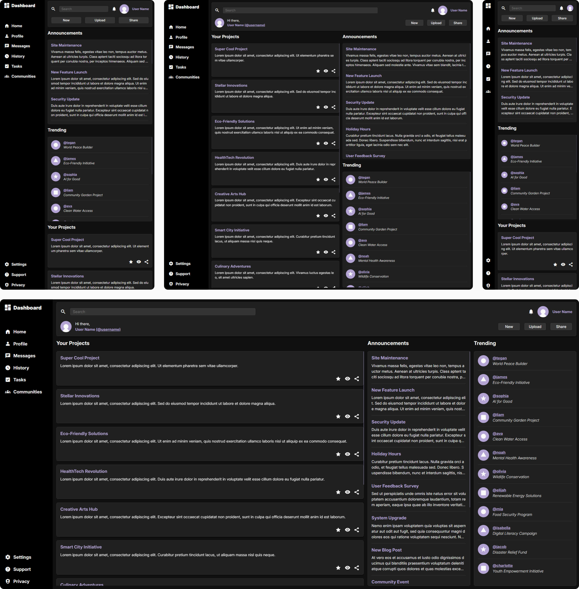

# Dashboard

This project is a part of [The Odin Project's Intermediate HTML and CSS course](https://www.theodinproject.com/paths/full-stack-javascript/courses/intermediate-html-and-css).

> [Live Demo](https://lernywensi.github.io/dashboard)

## Built with

-   HTML
-   CSS
-   JavaScript

## Task

-   The objective was to create a dashboard based on the provided reference, utilizing both `grid` and `flexbox`, with a primary emphasis on `grid`.
-   Responsiveness was an optional task, which has been successfully completed.

## Preview | [Live](https://lernywensi.github.io/dashboard)

## Provided reference

